# UDANPATH — COMPLETE SYSTEM DIAGRAM SET (UML, DFD & SYSTEM ARCHITECTURE)

This document contains the complete set of system diagrams for **UdanPath** (The Ultimate AI-Powered Exam Navigation Platform for India). The diagrams reflect the actual codebase structure, database tables, and API services of the UdanPath system.

---

## TABLE OF CONTENTS
1. [System Context Diagram](#1-system-context-diagram)
2. [Use Case Diagram](#2-use-case-diagram)
3. [Use Case Relationships](#3-use-case-relationships)
4. [DFD Level 0 (Context-Level DFD)](#4-dfd-level-0-context-level-dfd)
5. [DFD Level 1 (System Decomposition)](#5-dfd-level-1-system-decomposition)
6. [DFD Level 2 — Exam Discovery](#6-dfd-level-2-exam-discovery)
7. [DFD Level 2 — Eligibility Engine](#7-dfd-level-2-eligibility-engine)
8. [DFD Level 2 — Recommendation Engine](#8-dfd-level-2-recommendation-engine)
9. [DFD Level 2 — AI Advisor](#9-dfd-level-2-ai-advisor)
10. [DFD Level 2 — PDF/RAG Processing](#10-dfd-level-2-pdfrag-processing)
11. [DFD Level 2 — Live Exam Data Management](#11-dfd-level-2-live-exam-data-management)
12. [Activity Diagram — Complete Student Journey](#12-activity-diagram-complete-student-journey)
13. [Activity Diagram — Exam Recommendation](#13-activity-diagram-exam-recommendation)
14. [Activity Diagram — AI Advisor](#14-activity-diagram-ai-advisor)
15. [Activity Diagram — PDF/RAG](#15-activity-diagram-pdfrag)
16. [Sequence Diagram — Login](#16-sequence-diagram-login)
17. [Sequence Diagram — Profile & Recommendation](#17-sequence-diagram-profile-recommendation)
18. [Sequence Diagram — Exam Discovery](#18-sequence-diagram-exam-discovery)
19. [Sequence Diagram — AI Advisor](#19-sequence-diagram-ai-advisor)
20. [Sequence Diagram — PDF/RAG](#20-sequence-diagram-pdfrag)
21. [Sequence Diagram — Live Exam Data Update](#21-sequence-diagram-live-exam-data-update)
22. [Sequence Diagram — Notification](#22-sequence-diagram-notification)
23. [Class Diagram](#23-class-diagram)
24. [ER Diagram / Database Relationship Diagram](#24-er-diagram-database-relationship-diagram)
25. [Component Diagram](#25-component-diagram)
26. [Deployment Diagram](#26-deployment-diagram)
27. [Admin Workflow Diagram](#27-admin-workflow-diagram)
28. [Data Flow for Real Exam Data](#28-data-flow-for-real-exam-data)

---

## 1. System Context Diagram
### Purpose
Establishes the boundary of the UdanPath system, showing how it serves as the central hub connecting students, administrators, authentication systems, databases, storage buckets, Google Gemini AI services, and external official examination portals.

### Actors & Components
*   **Student**: Interacts with the platform to discover exams, view recommendations, configure their profile, track progress, and converse with the AI Advisor.
*   **Admin**: Manages system databases, verifies scraped updates, and monitors system logs.
*   **Supabase (Auth/DB/Storage)**: Handles session management, storage of PDF/Syllabus files, and user/exam relational databases.
*   **Google Gemini AI**: Provides chat endpoints, personal advice synthesis, resume checks, and document RAG summaries.
*   **Official Exam Sources**: Web services like UPSC/SSC portals scraped by the system scheduler.

### Flow & Relationships
The student logs in through Supabase Auth, retrieves exam lists from Supabase DB, gets advice from Gemini, and uploads PDFs to Storage. The scheduler checks official portals, updating databases or queueing verification logs for Admin review.

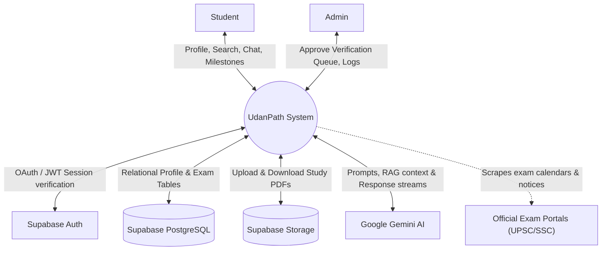

---

## 2. Use Case Diagram
### Purpose
Defines the functional requirements of the UdanPath platform from the perspective of its two main actors: the **Student** (end user) and the **Admin** (system operator).

```mermaid
graph LR
  subgraph UdanPath System Boundary
    %% Student Use Cases
    UC1([Register / Login])
    UC2([Google Auth Login])
    UC3([Complete Profile])
    UC4([Edit Profile & Preferences])
    UC5([Discover Exams])
    UC6([Search & Filter Exams])
    UC7([View Exam Details & Syllabus])
    UC8([Check Eligibility])
    UC9([View Recommended Exams])
    UC10([Apply via Official URL])
    UC11([Save Exams & Bookmarks])
    UC12([View Courses & Coaching])
    UC13([Access YT Videos & PYQs])
    UC14([Read Aspirant Experiences])
    UC15([Follow Prep Roadmap])
    UC16([Track Progress Milestones])
    UC17([Receive Dates Notifications])
    UC18([Use AI Advisor Chat])
    UC19([Upload PDF & Ask Questions])
    UC20([Get Personal Advice])
    
    %% Admin Use Cases
    UC21([Admin Secure Login])
    UC22([Manage Users & Profiles])
    UC23([Manage Exam Master Data])
    UC24([Manage Eligibility Rules])
    UC25([Review Scraped Date Changes])
    UC26([Approve / Reject verification queue])
    UC27([Manage Courses, Coaching & YT Links])
    UC28([Publish Aspirant Experiences])
    UC29([Manage Roadmaps])
    UC30([Broadcast Notifications])
    UC31([Monitor AI Usage Logs])
  end

  Student((Student)) --> UC1
  Student --> UC2
  Student --> UC3
  Student --> UC4
  Student --> UC5
  Student --> UC6
  Student --> UC7
  Student --> UC8
  Student --> UC9
  Student --> UC10
  Student --> UC11
  Student --> UC12
  Student --> UC13
  Student --> UC14
  Student --> UC15
  Student --> UC16
  Student --> UC17
  Student --> UC18
  Student --> UC19
  Student --> UC20

  Admin((Admin)) --> UC21
  Admin --> UC22
  Admin --> UC23
  Admin --> UC24
  Admin --> UC25
  Admin --> UC26
  Admin --> UC27
  Admin --> UC28
  Admin --> UC29
  Admin --> UC30
  Admin --> UC31
```

---

## 3. Use Case Relationships
### Purpose
Exhibits the structured dependencies between core functional use cases, specifically focusing on `<<include>>` and `<<extend>>` UML notations to clarify system modularity.

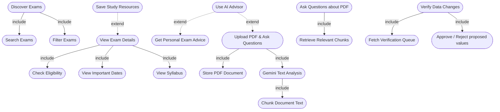

---

## 4. DFD Level 0 (Context-Level DFD)
### Purpose
Draws the high-level boundary of data processing in UdanPath, illustrating the input and output data streams between the main processing bubble and external actors/entities.

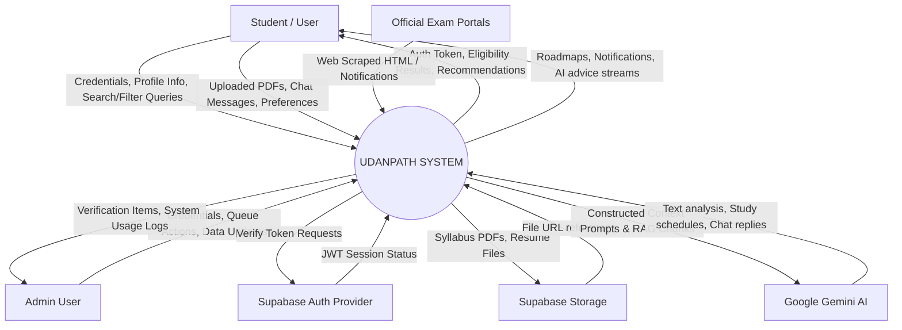

---

## 5. DFD Level 1 (System Decomposition)
### Purpose
Decomposes the core system into 12 distinct processes and exposes the main data stores accessed during transactions.

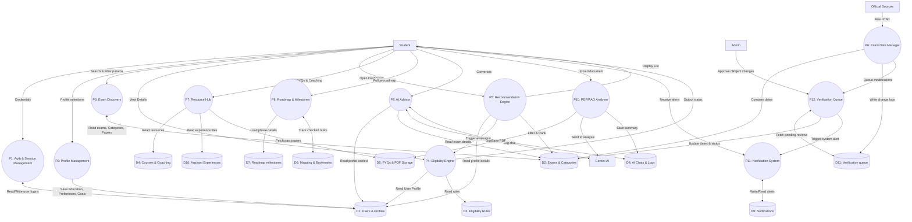

---

## 6. DFD Level 2 — Exam Discovery
### Purpose
Exposes the granular data transitions occurring when a student searches, filters, or views consolidation details of competitive examinations.

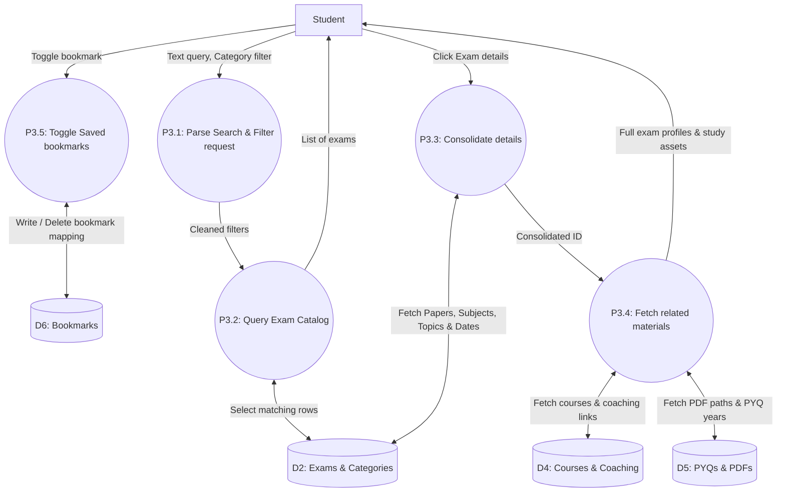

---

## 7. DFD Level 2 — Eligibility Engine
### Purpose
Models how the system automatically checks student criteria (Age, Education Level, Degree, Branch, Category, and State) against specific rules defined per exam.

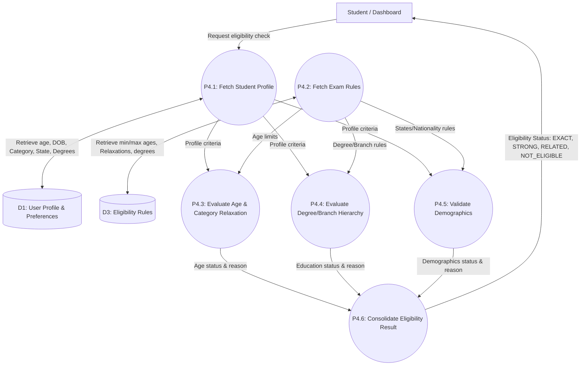

---

## 8. DFD Level 2 — Recommendation Engine
### Purpose
Exhibits the data paths for personalized exam recommendation calculations, highlighting that eligibility checks execute prior to interest or career goal scoring.

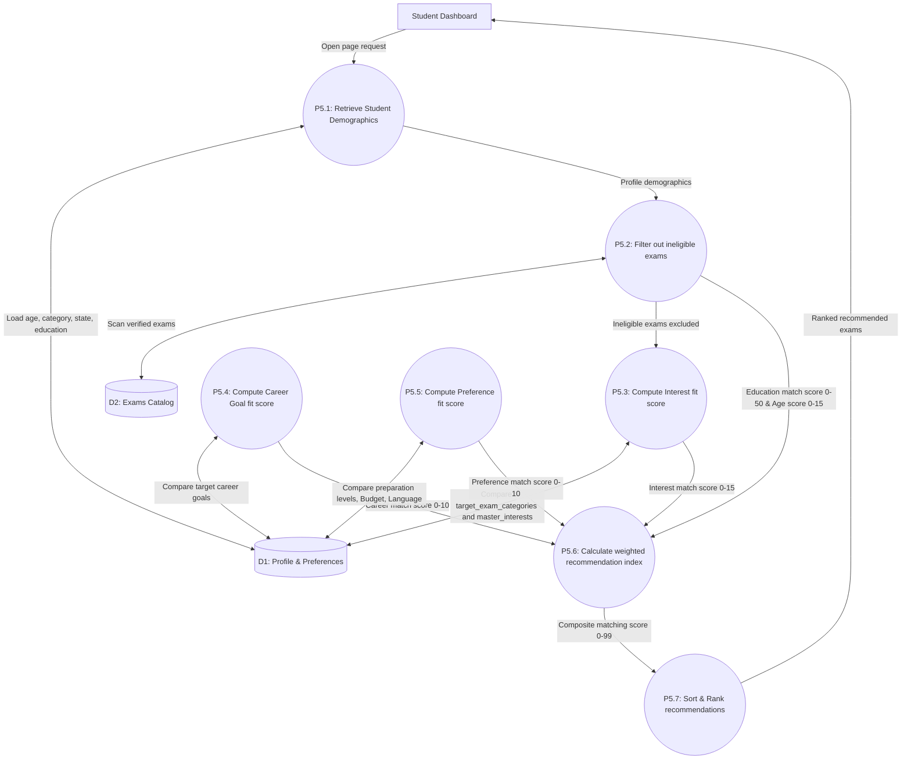

---

## 9. DFD Level 2 — AI Advisor
### Purpose
Shows the flow of querying the Gemini AI Advisor, integrating profile and exam details to return personalized assistance while recording the conversation log.

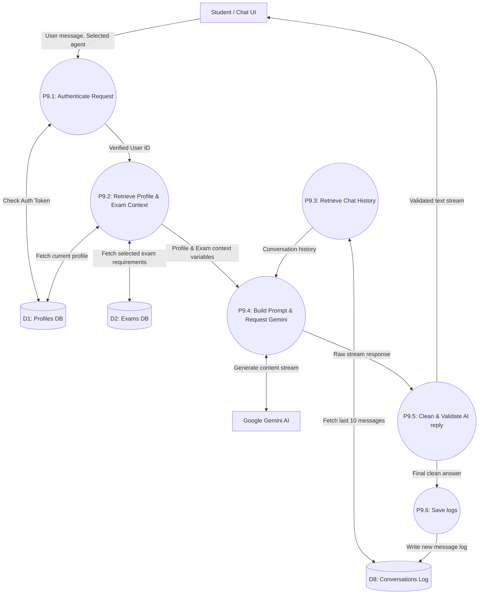

---

## 10. DFD Level 2 — PDF/RAG Processing
### Purpose
Shows the two distinct paths of document handling: indexing uploaded documents via Gemini natively, and retrieval QA context building.

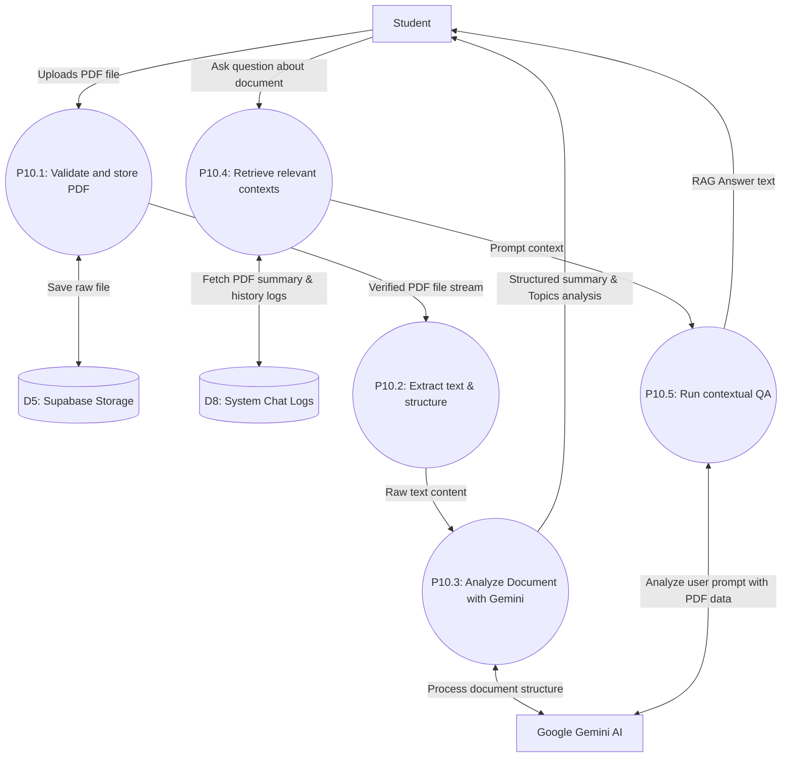

---

## 11. DFD Level 2 — Live Exam Data Management
### Purpose
Documents the automated date verification loop, showing parser inputs, change detection, and how discrepancies flow to the admin queue.

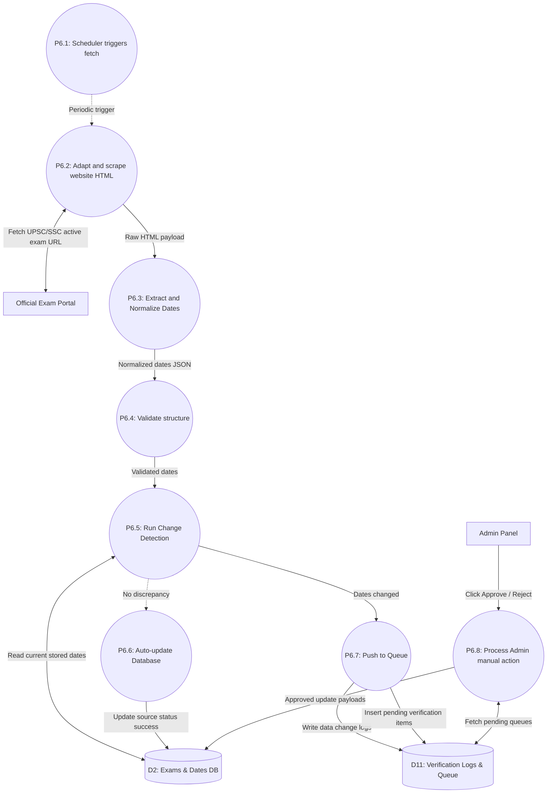

---

## 12. Activity Diagram — Complete Student Journey
### Purpose
Visualizes the sequential workflow of a student onboarding onto UdanPath, completing personalization, obtaining recommendations, and tracking exam readiness.

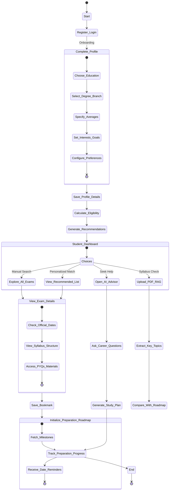

---

## 13. Activity Diagram — Exam Recommendation
### Purpose
Outlines the execution path of the recommendation logic, demonstrating that a candidate is evaluated for mandatory eligibility constraints prior to preference scoring.

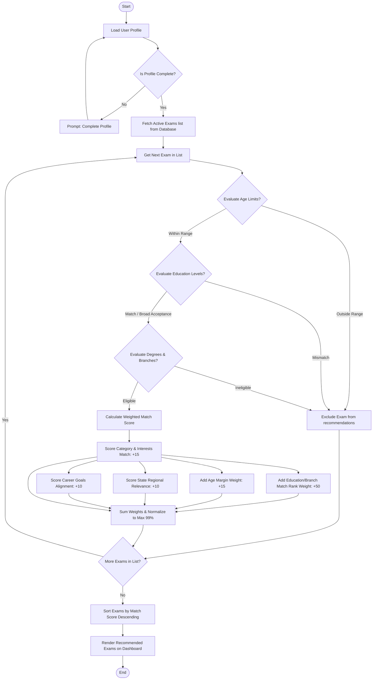

---

## 14. Activity Diagram — AI Advisor
### Purpose
Visualizes the decision hierarchy of the AI Advisor, demonstrating how context (User Profile, Exam DB, and History) is compiled before hitting Gemini.

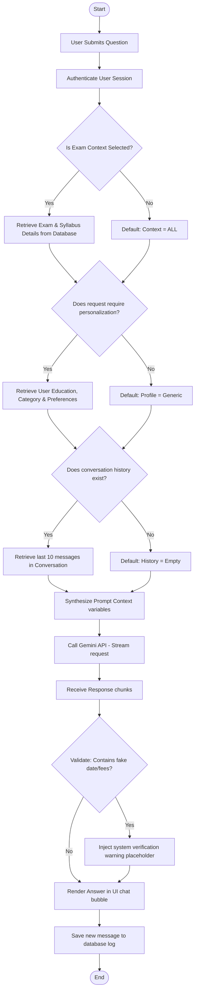

---

## 15. Activity Diagram — PDF/RAG
### Purpose
Illustrates the document processing and contextual question-answering workflow for user-uploaded syllabus or resource PDF files.

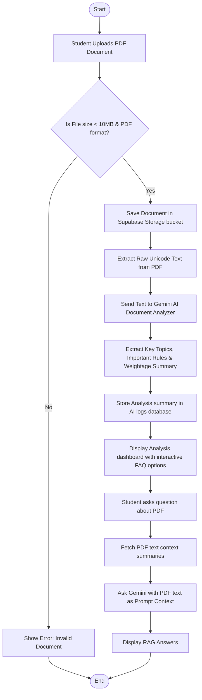

---

## 16. Sequence Diagram — Login
### Purpose
Displays the authentication exchange sequence between the student client, frontend middleware, backend API, and Supabase security providers.

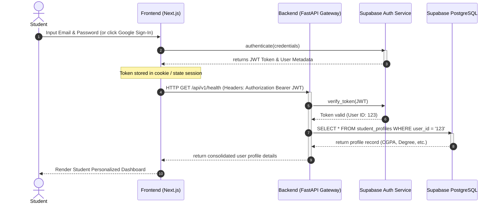

---

## 17. Sequence Diagram — Profile & Recommendation
### Purpose
Illustrates how the frontend and backend interact with the eligibility and recommendation engines in real-time when a profile is completed or loaded.

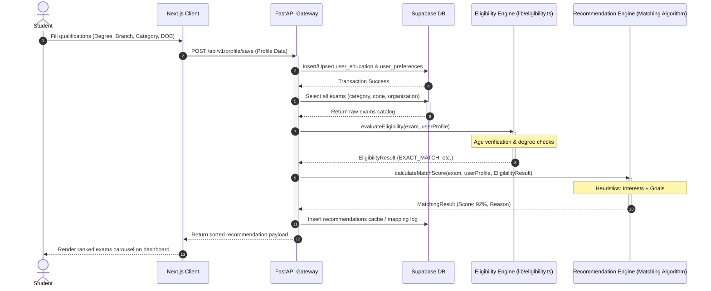

---

## 18. Sequence Diagram — Exam Discovery
### Purpose
Traces the execution sequence when a student searches, filters, or views specific parameters (dates, syllabus, resources) of a competitive exam.

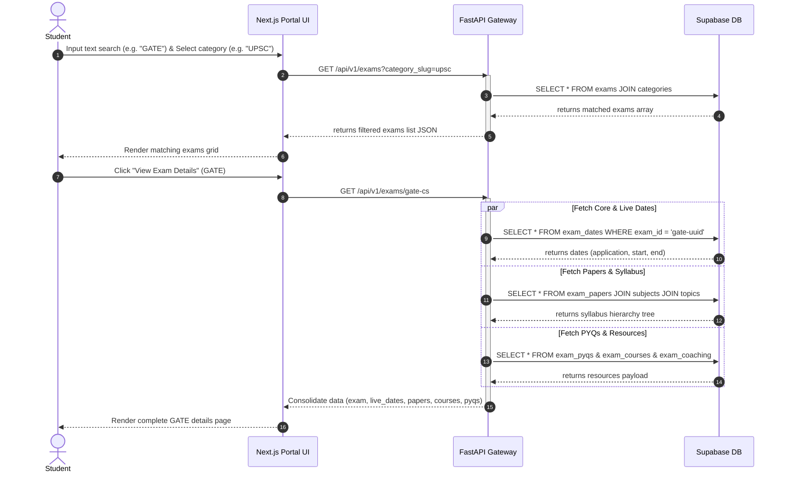

---

## 19. Sequence Diagram — AI Advisor
### Purpose
Traces the API exchange between the chatbot interface, the backend integration router, database profiles, and the Google Gemini streaming API.

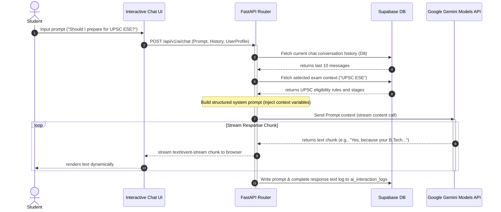

---

## 20. Sequence Diagram — PDF/RAG
### Purpose
Exhibits the sequence of text parsing, summary synthesis, and response retrieval for uploaded documents.

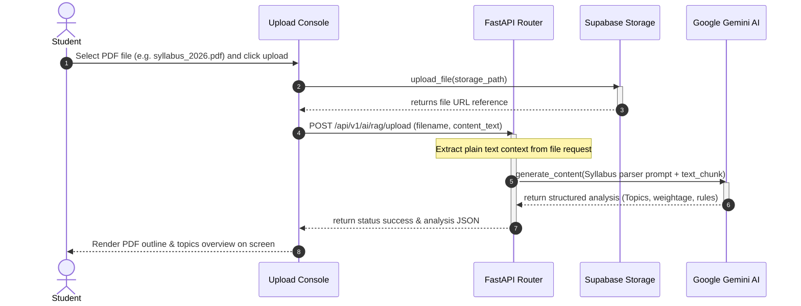

---

## 21. Sequence Diagram — Live Exam Data Update
### Purpose
Traces the background scheduler routine, from scraping official portals to change detection, verification queues, admin approvals, and final writes.

```mermaid
sequenceDiagram
  autonumber
  participant Sched as Background Scheduler (scheduler.py)
  participant Adap as UPSC/SSC Adapters
  participant Web as Official Exam Portal (HTML website)
  participant DB as Supabase Database
  participant Queue as data_verification_queue
  actor Admin as Administrator
  participant Client as Student Frontend Client

  loop Every 6 Hours
    Sched ->> Adap: Trigger fetch_sources_job()
    activate Adap
    Adap ->> Web: HTTP GET Active Examination Calendar URL
    Web -->> Adap: returns Raw HTML page
    
    Adap ->> Adap: parse(raw_html) & extract dates
    Adap ->> Adap: validate(parsed_data) structure
    
    Adap ->> DB: Compare dates with existing exams tables
    
    alt Date matches database
      Adap ->> DB: update_source_status(success=true)
    else Discrepancy detected
      Adap ->> Queue: Insert PENDING change items (exam_id, field_name, proposed_value)
      Adap ->> DB: update_source_status(success=true, flag="DISCREPANCY")
    end
    deactivate Adap
  end

  Admin ->> Queue: GET /api/v1/admin/verification-queue
  Queue -->> Admin: returns pending date changes list
  Admin ->> Queue: POST /api/v1/admin/verification/{item_id}/approve
  activate Queue
  Queue ->> DB: Upsert approved dates into exam_dates table
  Queue ->> Queue: Mark item status = 'APPROVED'
  Queue -->> Admin: Return success message
  deactivate Queue

  Client ->> DB: GET verified exam calendar details
  DB -->> Client: returns updated dates JSON
  Client -->> Student: displays corrected exam application deadline (Live Update)
```

---

## 22. Sequence Diagram — Notification
### Purpose
Visualizes the automated triggering of alerts when exam status changes or deadlines approach.

```mermaid
sequenceDiagram
  autonumber
  participant Job as Live Exam Update / Scraper
  participant DB as Supabase Database
  participant NS as Notification Service
  participant Client as Next.js Client
  actor Student as Student

  Job ->> DB: Upsert updated verified exam dates (e.g. UPSC CSE application open)
  DB -->> Job: Transaction saved

  Job ->> NS: Trigger alert broadcast (exam_id, message_type: 'date_change')
  activate NS

  NS ->> DB: SELECT user_id FROM user_target_exams_mapping WHERE exam_id = 'upsc-uuid'
  DB -->> NS: returns target users list

  loop For each subscriber
    NS ->> DB: INSERT INTO user_notifications (user_id, type: 'date', title, body, read: false)
  end
  deactivate NS

  Client ->> DB: Poll/Query user_notifications where user_id = mine
  DB -->> Client: return unread notifications array (1 alert)
  Client -->> Student: Renders red dot badge and plays subtle alert sound
  Student ->> Client: Clicks notification (Mark as read)
  Client ->> DB: UPDATE user_notifications SET read = true
```

---

## 23. Class Diagram
### Purpose
Presents the object-oriented structure of UdanPath's entities, showing attributes and methods in standard UML class notations.

```mermaid
classDiagram
    direction TB
    class User {
        +UUID id
        +String email
        +String full_name
        +String avatar_url
        +String phone_number
        +String role
        +Boolean is_active
        +Boolean is_verified
        +login()
        +logout()
        +updateProfile()
    }
    
    class Profile {
        +UUID id
        +UUID user_id
        +Date date_of_birth
        +String gender
        +String category
        +String state
        +String highest_qualification
        +String stream
        +Decimal percentage_aggregate
    }
    
    class UserEducation {
        +UUID id
        +UUID user_id
        +UUID education_level_id
        +UUID degree_id
        +UUID branch_id
        +String status
        +String semester
        +Int passing_year
    }

    class UserPreferences {
        +UUID user_id
        +String study_time
        +String preparation_mode
        +String language_preference
        +String budget_online
        +String budget_offline
        +Int target_year
        +String preparation_status
        +String[] preferred_learning_formats
    }

    class Exam {
        +UUID id
        +UUID category_id
        +String name
        +String short_name
        +String slug
        +String organization
        +String frequency
        +String exam_level
        +Decimal fee_general
        +Decimal fee_reserved
        +String official_website
        +String notification_pdf_url
        +Boolean is_featured
        +String status
    }

    class ExamCategory {
        +UUID id
        +String name
        +String slug
        +String description
        +String icon_name
        +Int display_order
    }

    class ExamPaper {
        +UUID id
        +UUID exam_id
        +String name
        +String code
        +String description
    }

    class ExamSubject {
        +UUID id
        +UUID paper_id
        +String name
        +Decimal weightage_percentage
    }

    class ExamTopic {
        +UUID id
        +UUID subject_id
        +String name
        +String description
    }

    class EligibilityRule {
        +UUID id
        +UUID exam_id
        +UUID paper_id
        +String rule_type
        +String condition_key
        +String condition_value
        +String description
        +Boolean is_mandatory
    }

    class ExamDate {
        +UUID id
        +UUID exam_id
        +Date notification_release_date
        +Date application_start_date
        +Date application_end_date
        +Date exam_start_date
        +String status
        +UUID source_id
        +String verification_status
    }

    class ExamSource {
        +UUID id
        +String name
        +String organization
        +String source_type
        +String base_url
        +String exam_url
        +Boolean is_active
        +String fetch_method
        +DateTime last_checked_at
    }

    class ExamPYQ {
        +UUID id
        +UUID exam_id
        +UUID paper_id
        +Int year
        +String question_type
        +String pdf_url
        +Boolean verified
    }

    class ExamPDF {
        +UUID id
        +UUID exam_id
        +String title
        +String document_type
        +String storage_path
        +Boolean verified
    }

    class ExamCourse {
        +UUID id
        +UUID exam_id
        +String provider_name
        +String course_name
        +String price_info
        +String official_link
        +Boolean is_verified
    }

    class ExamCoaching {
        +UUID id
        +UUID exam_id
        +String institute_name
        +String city
        +String mode
        +Boolean is_verified
    }

    class ExamYoutubeResource {
        +UUID id
        +UUID exam_id
        +String title
        +String channel_name
        +String url
        +Boolean is_verified
    }

    class ExamMilestone {
        +UUID id
        +UUID exam_id
        +String tier
        +Int duration_months
        +Int phase_order
        +String phase_name
        +JSONB tasks
    }

    class UserStudyProgress {
        +UUID id
        +UUID user_id
        +UUID exam_id
        +UUID syllabus_topic_id
        +Boolean is_completed
        +DateTime completed_at
    }

    class AspirantExperience {
        +UUID id
        +UUID exam_id
        +String display_name
        +String rank
        +String score
        +String[] subjects_focused
        +String advice
        +String verification_status
    }

    class ExperienceMedia {
        +UUID id
        +UUID experience_id
        +String media_type
        +String title
        +String url
    }

    class UserNotification {
        +UUID id
        +UUID user_id
        +String type
        +String title
        +String body
        +Boolean read
    }

    class AIConversation {
        +UUID id
        +UUID user_id
        +String feature_used
        +String prompt_text
        +String response_text
        +DateTime created_at
    }

    User "1" -- "1" Profile : owns
    User "1" -- "*" UserEducation : builds
    User "1" -- "1" UserPreferences : configures
    User "1" -- "*" UserNotification : receives
    User "1" -- "*" AIConversation : queries
    
    Profile "1" -- "*" UserStudyProgress : tracks
    
    Exam "*" -- "1" ExamCategory : belongs_to
    Exam "1" -- "*" ExamPaper : contains
    Exam "1" -- "*" EligibilityRule : restricts
    Exam "1" -- "*" ExamDate : schedules
    Exam "1" -- "*" ExamPYQ : references
    Exam "1" -- "*" ExamPDF : hosts
    Exam "1" -- "*" ExamCourse : recommends
    Exam "1" -- "*" ExamCoaching : lists
    Exam "1" -- "*" ExamYoutubeResource : guides
    Exam "1" -- "*" ExamMilestone : structures
    Exam "1" -- "*" AspirantExperience : inspires
    
    ExamPaper "1" -- "*" ExamSubject : outlines
    ExamSubject "1" -- "*" ExamTopic : details
    
    AspirantExperience "1" -- "*" ExperienceMedia : embeds
    ExamDate "*" -- "1" ExamSource : fetched_from
```

---

## 24. ER Diagram / Database Relationship Diagram
### Purpose
Exhibits the database relations, keys, mapping constraints, and cardinality representing the exact production schema inside Supabase.

```mermaid
erDiagram
    users {
        uuid id PK
        varchar email UK
        varchar hashed_password
        varchar full_name
        varchar avatar_url
        varchar role
        timestamp created_at
    }

    student_profiles {
        uuid id PK
        uuid user_id FK
        date date_of_birth
        varchar category
        varchar state
        varchar highest_qualification
        varchar stream
        numeric percentage_aggregate
    }

    master_education_levels {
        uuid id PK
        varchar name UK
        int display_order
    }

    master_degrees {
        uuid id PK
        uuid education_level_id FK
        varchar name
    }

    master_branches {
        uuid id PK
        uuid degree_id FK
        varchar name
    }

    user_education {
        uuid id PK
        uuid user_id FK
        uuid education_level_id FK
        uuid degree_id FK
        uuid branch_id FK
        varchar status
        int passing_year
    }

    user_preferences {
        uuid user_id PK, FK
        varchar study_time
        varchar preparation_mode
        varchar language_preference
        int target_year
        text_array preferred_learning_formats
    }

    exam_categories {
        uuid id PK
        varchar name UK
        varchar slug UK
        int display_order
    }

    exams {
        uuid id PK
        varchar name
        varchar short_name UK
        varchar slug UK
        varchar organization
        uuid category_id FK
        varchar status
        varchar verification_status
    }

    exam_dates {
        uuid id PK
        uuid exam_id FK, UK
        date notification_release_date
        date application_start_date
        date application_end_date
        date exam_start_date
        uuid source_id FK
        varchar verification_status
    }

    exam_sources {
        uuid id PK
        varchar name
        varchar source_type
        text base_url
        text exam_url
        boolean is_active
    }

    exam_papers {
        uuid id PK
        uuid exam_id FK
        varchar name
        varchar code
    }

    exam_subjects {
        uuid id PK
        uuid paper_id FK
        varchar name
        numeric weightage_percentage
    }

    exam_topics {
        uuid id PK
        uuid subject_id FK
        varchar name
    }

    exam_eligibility_rules {
        uuid id PK
        uuid exam_id FK
        uuid paper_id FK
        varchar rule_type
        varchar condition_key
        text condition_value
    }

    user_bookmarks {
        uuid id PK
        uuid user_id FK
        uuid exam_id FK
    }

    exam_milestones {
        uuid id PK
        uuid exam_id FK
        varchar tier
        int phase_order
        varchar phase_name
        jsonb tasks
    }

    user_study_progress {
        uuid id PK
        uuid user_id FK
        uuid exam_id FK
        uuid syllabus_topic_id FK
        boolean is_completed
    }

    data_verification_queue {
        uuid id PK
        uuid exam_id FK
        uuid source_id FK
        varchar field_name
        text proposed_value
        varchar status
        uuid reviewed_by FK
    }

    user_notifications {
        uuid id PK
        uuid user_id FK
        varchar type
        varchar title
        text body
        boolean read
    }

    ai_interaction_logs {
        uuid id PK
        uuid user_id FK
        varchar feature_used
        text prompt_text
        text response_text
        int tokens_used
    }

    %% Relationships
    users ||--o| student_profiles : "has"
    users ||--o| user_preferences : "configures"
    users ||--o{ user_education : "completes"
    users ||--o{ user_bookmarks : "saves"
    users ||--o{ user_notifications : "receives"
    users ||--o{ ai_interaction_logs : "interacts"

    master_education_levels ||--o{ master_degrees : "contains"
    master_degrees ||--o{ master_branches : "contains"

    user_education }o--|| master_education_levels : "references"
    user_education }o--|| master_degrees : "references"
    user_education }o--|| master_branches : "references"

    exams }o--|| exam_categories : "classified_by"
    exams ||--o| exam_dates : "scheduled_in"
    exams ||--o{ exam_papers : "stages"
    exams ||--o{ exam_eligibility_rules : "restricted_by"
    exams ||--o{ exam_milestones : "split_into"
    exams ||--o{ user_bookmarks : "saved_in"

    exam_dates }o--|| exam_sources : "obtained_from"
    exam_papers ||--o{ exam_subjects : "outlines"
    exam_subjects ||--o{ exam_topics : "details"

    user_study_progress }o--|| exams : "references"
    user_study_progress }o--|| exam_topics : "tracks"
    user_study_progress }o--|| users : "belongs_to"

    data_verification_queue }o--|| exams : "triggers_for"
    data_verification_queue }o--|| exam_sources : "fetched_by"
    data_verification_queue }o--|| users : "reviewed_by_admin"
```

---

## 25. Component Diagram
### Purpose
Visualizes the major modular code interfaces and service layers of the platform, including frontend UI components, backend routing middleware, external APIs, and database triggers.

```mermaid
graph TD
  subgraph Frontend_App["Frontend Application (Next.js Node)"]
    UI[Portal Pages & Dynamic Dashboards]
    JS_Clients[Supabase Client Engine]
    EE_FE[Eligibility Engine Client]
  end

  subgraph Backend_App["Backend Integration Gateway (FastAPI Uvicorn)"]
    API[FastAPI Router /api/v1]
    GeminiClient[Gemini Client Wrapper]
    SubClient[Supabase Backend Client Admin]
    Sched[Background Tasks Scheduler]
    Adapters[UPSC/SSC Scraper Adapters]
  end

  subgraph Supabase_Cloud["Supabase Cloud Platform"]
    Auth[Supabase Auth Module]
    DB[(PostgreSQL Database)]
    Storage[(Supabase Storage Buckets)]
  end

  subgraph AI_Platform["Google Cloud Services"]
    GeminiModel[Google Gemini AI Engine]
  end

  subgraph Scrape_Targets["Official Web Portals"]
    Portals[UPSC / SSC Sites]
  end

  %% Links
  UI -->|HTTP requests & Route navigation| API
  JS_Clients -->|Session token validation| Auth
  JS_Clients -->|Read-only tables| DB
  JS_Clients -->|Direct storage upload| Storage

  API -->|Verify token status| Auth
  API -->|Admin upsert/select fallbacks| SubClient
  SubClient -->|Service role key read/write| DB
  SubClient -->|Fetch storage PDF structures| Storage

  API -->|Initialize chat prompts & vectors| GeminiClient
  GeminiClient -->|REST stream calls| GeminiModel

  Sched -->|Execute periodic worker| Adapters
  Adapters -->|Scrape DOM & Parse dates| Portals
  Adapters -->|Upsert changes / Queue review| SubClient
```

---

## 26. Deployment Diagram
### Purpose
Shows the hardware nodes and physical deployment architecture of the UdanPath services.

```mermaid
graph TD
  subgraph Client_Tier["Client Domain"]
    Browser[Web Browser / Chrome, Safari]
  end

  subgraph CDN_Tier["Vercel Cloud Platform"]
    Vercel[Vercel Serverless Edge CDN]
    FE_Server[Next.js SSR Nodes]
  end

  subgraph Server_Tier["Render Cloud Service / Container Engine"]
    FastAPI_Container[FastAPI Router Docker Container]
    Python_Env[Python 3.10 Runtime Uvicorn]
  end

  subgraph Database_Tier["Supabase Managed Cloud (AWS East)"]
    Supabase_Server[PostgreSQL Instance DB / RLS Configured]
    Auth_Node[Go-True Auth Server]
    Storage_Node[S3 Storage Wrapper]
  end

  subgraph External_Cloud["Google AI Platform"]
    Gemini_API[Gemini Pro API endpoint]
  end

  subgraph Govt_Servers["Official Hosting Centers"]
    NIC[NIC Server UPSC / SSC Portals]
  end

  %% Connections
  Browser -->|HTTPS/TLS: Port 443| Vercel
  Vercel -->|Renders SSR Pages| FE_Server
  Browser -->|Direct Web API / API routing| FastAPI_Container
  Browser -->|JWT Session checks| Auth_Node
  Browser -->|Media assets| Storage_Node

  FE_Server -->|Proxy queries| FastAPI_Container

  FastAPI_Container -->|Runs application| Python_Env
  Python_Env -->|Supabase connection pool| Supabase_Server
  Python_Env -->|Internal scheduler crawler| NIC
  Python_Env -->|AI stream RPC calls| Gemini_API
```

---

## 27. Admin Workflow Diagram
### Purpose
Exhibits the functional dashboard workflow of the system administrator, specifically emphasizing the date scrapers verification queue.

```mermaid
graph TD
  Start([Start]) --> Login[Admin Logs into Dashboard]
  Login --> CheckSession{Is Admin Role Valid?}
  
  CheckSession -->|No| AccessDenied[Show Error: Access Denied]
  AccessDenied --> End([End])

  CheckSession -->|Yes| RenderDashboard[Render Admin Workspace]
  RenderDashboard --> SelectOption{Select Action}
  
  SelectOption --> ManageExams[Create/Modify Exam Master Data]
  ManageExams --> SaveDB[Update Exams table in DB]
  
  SelectOption --> ViewQueue[View Live Scraper Verification Queue]
  ViewQueue --> FetchItems[Query PENDING queue list]
  FetchItems --> ShowDiscrepancy[Display Proposed Date vs Current Date]
  
  ShowDiscrepancy --> AdminDecision{Admin Review Decision}
  
  AdminDecision -->|Approve| UpsertDate[Update live exam_dates table]
  UpsertDate --> MarkApproved[Set queue status = APPROVED]
  MarkApproved --> TriggerAlert[Trigger notification alerts to target users]
  
  AdminDecision -->|Reject| MarkRejected[Set queue status = REJECTED]
  
  TriggerAlert & MarkRejected --> CheckQueue{More pending items?}
  CheckQueue -->|Yes| FetchItems
  CheckQueue -->|No| RenderDashboard

  SelectOption --> MonitorLogs[Monitor System & Gemini API Logs]
  MonitorLogs --> RenderDashboard
  
  SaveDB --> RenderDashboard
```

---

## 28. Data Flow for Real Exam Data
### Purpose
Tracks the data transformations of live dates from scraping official websites to updating the student UI, as requested in Section 35.

```mermaid
graph LR
  OfficialSource[Official Exam Portal]
  DataCollection[Data Collector]
  Parser[HTML Parser]
  Normalizer[Data Normalizer]
  Validator[Data Validator]
  ChangeDetection[Change Detection]
  Verification[Verification Queue]
  AdminReview{Admin Review}
  Supabase[(Supabase DB)]
  FastAPI[FastAPI Gateway]
  Frontend[Next.js Client]
  Student[Student User]

  OfficialSource -->|Scraped HTML data| DataCollection
  DataCollection -->|Raw text stream| Parser
  Parser -->|Extracted table rows| Normalizer
  Normalizer -->|Standard ISO dates| Validator
  Validator -->|Validated dates JSON| ChangeDetection
  
  ChangeDetection -->|Dates differ from DB| Verification
  ChangeDetection -->|Dates identical| DBUpdateDirect[Update Scrape Status Success]
  DBUpdateDirect --> Supabase

  Verification -->|Queue Item created| AdminReview
  AdminReview -->|APPROVED| Supabase
  AdminReview -->|REJECTED| RejectArchive[Archive Rejected Change]

  Supabase -->|Select *| FastAPI
  FastAPI -->|JSON Endpoint| Frontend
  Frontend -->|Render UI calendar| Student
```
